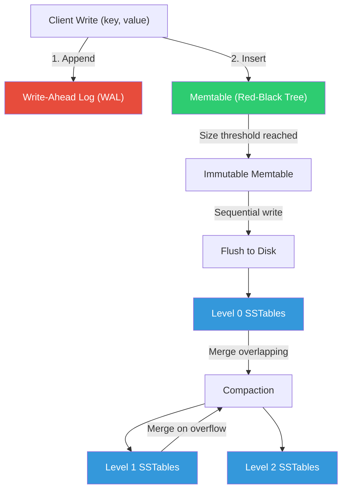
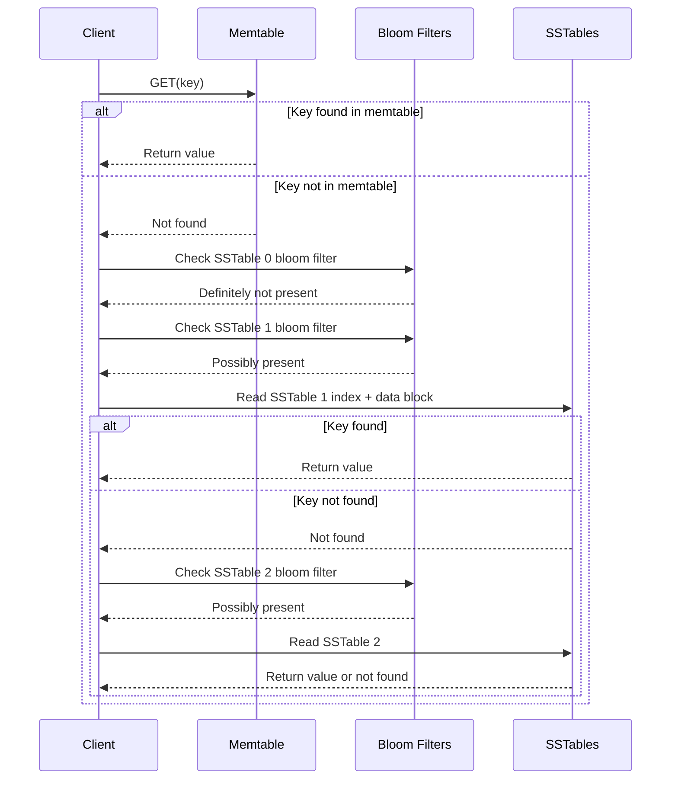
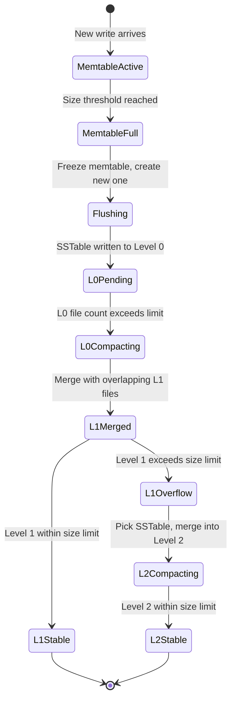

# LSM Storage Engine

A log-structured merge-tree (LSM-tree) storage engine built from scratch: in-memory memtable backed by a red-black tree, sorted string tables (SSTables) with block-based indexing, write-ahead logging for crash recovery, bloom filters for fast negative lookups, and both size-tiered and leveled compaction strategies. Demonstrates the core storage engine architecture behind systems like LevelDB, RocksDB, Cassandra, and HBase — and why the LSM-tree is the dominant write-optimized data structure in modern databases.

## Theory & Background

### Why LSM-Trees?

Traditional databases use B-trees, which store data in fixed-size pages and update them in place. This works well for reads — a point lookup is $O(\log_B N)$ disk seeks — but writes are expensive. Every update requires reading a page, modifying it, and writing it back, which means **random I/O**. On spinning disks, random writes are 100-1000x slower than sequential writes. Even on SSDs, random writes cause write amplification due to the erase-before-write nature of flash storage.

LSM-trees flip this tradeoff. Instead of updating data in place, they **buffer writes in memory** and periodically flush them to disk as large, sorted, immutable files. All disk writes are sequential, which is the fastest possible I/O pattern on any storage medium. The cost is that reads may need to check multiple files, and background compaction is needed to merge files and reclaim space. This write-optimized design makes LSM-trees ideal for workloads with high write throughput — time-series data, event logs, key-value stores, and analytics ingestion.

### How It Works

The engine operates in layers. Writes go to an in-memory buffer (the memtable). When the memtable is full, it's flushed to disk as an immutable SSTable. Over time, SSTables accumulate and are merged by a background compaction process. Reads check the memtable first, then SSTables from newest to oldest, using bloom filters to skip files that definitely don't contain the target key.



### The Memtable

The memtable is an in-memory sorted data structure that buffers recent writes. We use a **red-black tree** — a self-balancing binary search tree that guarantees $O(\log n)$ insert, delete, and lookup. Red-black trees maintain balance through node coloring (red or black) and rotations, ensuring that the longest path from root to leaf is at most twice the shortest path.

The key invariants of a red-black tree:

1. Every node is red or black
2. The root is black
3. No two consecutive red nodes (a red node's children are black)
4. Every path from root to a null leaf has the same number of black nodes (the **black-height**)

These invariants guarantee a height bound:

```math
h \leq 2 \log_2(n + 1)
```

where $n$ is the number of keys. This means insertions and lookups are $O(\log n)$ worst-case, unlike a plain BST which can degrade to $O(n)$.

When the memtable reaches a size threshold (typically 4-64 MB), it becomes **immutable** — no new writes are accepted. A new empty memtable is created for incoming writes, and the immutable memtable is scheduled for flushing to disk. This ensures writes are never blocked by disk I/O.

### SSTables (Sorted String Tables)

An SSTable is an immutable, sorted file on disk. It contains key-value pairs in sorted order, along with an index for fast lookups. The structure is:

```math
\text{SSTable} = [\text{Data Blocks}] \| [\text{Index Block}] \| [\text{Bloom Filter}] \| [\text{Footer}]
```

**Data blocks** contain sorted key-value pairs, typically 4-64 KB each. Keys within a block use **prefix compression** — only the bytes that differ from the previous key are stored, reducing space by 30-50% for keys with common prefixes.

**The index block** maps the first key of each data block to its offset, enabling binary search over blocks:

```math
\text{lookup}(k) = \text{binary\_search}(\text{index}, k) \to \text{block\_offset} \to \text{scan block for } k
```

A point lookup in an SSTable costs $O(\log B)$ where $B$ is the number of data blocks, plus a linear scan within the target block. With 4 KB blocks and 64 MB files, $B \approx 16{,}384$, so the binary search is about 14 comparisons.

### Write-Ahead Log (WAL)

The WAL ensures durability. Before a write is inserted into the memtable, it's appended to the WAL — a sequential, append-only file on disk. If the process crashes before the memtable is flushed, the WAL is replayed on restart to reconstruct the memtable.

The WAL entry format is simple:

```math
\text{entry} = [\text{CRC32}] \| [\text{length}] \| [\text{type}] \| [\text{key}] \| [\text{value}]
```

The CRC32 checksum detects corruption from partial writes. The type field distinguishes puts from deletes (tombstones). WAL writes are $O(1)$ amortized — just an append to the end of the file.

### Read Path and Bloom Filters

Reads check the memtable first (fast, in-memory), then SSTables from newest to oldest. Without optimization, a read for a non-existent key would scan every SSTable — potentially hundreds of files. **Bloom filters** solve this.

A bloom filter is a probabilistic data structure that answers "is this key in this SSTable?" with either "definitely no" or "probably yes." It uses $k$ hash functions to map each key to $k$ bit positions in a bit array of size $m$:

```math
\text{insert}(x): \text{bits}[h_i(x) \bmod m] = 1 \quad \text{for } i = 1, \ldots, k
```

```math
\text{query}(x): \bigwedge_{i=1}^{k} \text{bits}[h_i(x) \bmod m] = 1
```

The false positive rate is:

```math
\text{FPR} \approx \left(1 - e^{-kn/m}\right)^k
```

where $n$ is the number of keys. The optimal number of hash functions is $k = (m/n) \ln 2$. With 10 bits per key ($m/n = 10$), the FPR is about 1% — meaning 99% of unnecessary SSTable reads are avoided.



### Compaction Strategies

As SSTables accumulate, reads slow down (more files to check) and disk space grows (deleted keys still occupy space as tombstones). **Compaction** merges SSTables, removing duplicates and tombstones, and producing fewer, larger sorted files.

**Size-Tiered Compaction (STCS)**: Groups SSTables of similar size into tiers. When a tier has enough files (typically 4), they're merged into a single larger file in the next tier. This is simple and write-friendly — each byte is written $O(\log T)$ times where $T$ is the size ratio between tiers. The downside is **space amplification**: during compaction, both the old and new files exist simultaneously, requiring up to 2x the data size in disk space.

**Leveled Compaction (LCS)**: Organizes SSTables into levels with strict size limits. Level 0 contains unsorted flush output. Each subsequent level is $T$ times larger than the previous (typically $T = 10$). Within each level (except L0), SSTables have non-overlapping key ranges. When a level exceeds its size limit, one SSTable is picked and merged with all overlapping SSTables in the next level.

```math
\text{Level } i \text{ size limit} = T^i \times L_0\text{\_size}
```

Leveled compaction has lower space amplification ($\approx 1.1\times$) and better read performance (at most one SSTable per level to check), but higher write amplification — each byte is rewritten $O(T \cdot L)$ times where $L$ is the number of levels:

```math
\text{Write amplification (leveled)} \approx T \cdot L = T \cdot \log_T\left(\frac{N}{L_0}\right)
```



### Amplification Tradeoffs

LSM-tree design is fundamentally about balancing three types of amplification:

| Amplification | Definition | Size-Tiered | Leveled |
|--------------|-----------|-------------|---------|
| **Write** | Bytes written to disk / bytes written by user | $O(\log T)$ | $O(T \cdot \log_T N)$ |
| **Read** | Disk reads per user read | $O(T \cdot \log_T N)$ | $O(\log_T N)$ |
| **Space** | Disk space used / actual data size | Up to $2\times$ | $\approx 1.1\times$ |

No design can minimize all three simultaneously — this is the **RUM conjecture** (Read, Update, Memory). Size-tiered optimizes for writes at the cost of reads and space. Leveled optimizes for reads and space at the cost of writes. The choice depends on the workload.

```mermaid
gantt
    title LSM Write Path Timeline
    dateFormat X
    axisFormat %s

    section Client Write
        Append to WAL           :0, 1
        Insert into memtable    :1, 2

    section Flush (background)
        Serialize memtable      :10, 12
        Write SSTable to disk   :12, 15
        Update manifest         :15, 16
        Delete WAL segment      :16, 17

    section Compaction (background)
        Select input SSTables   :20, 21
        Merge-sort keys         :21, 28
        Write new SSTables      :28, 33
        Update manifest         :33, 34
        Delete old SSTables     :34, 35
```



### Tradeoffs and Alternatives

| Aspect | This Implementation | Alternative | Tradeoff |
|--------|-------------------|-------------|----------|
| **Memtable** | Red-black tree | Skip list (LevelDB), ART (adaptive radix tree) | Red-black tree has guaranteed $O(\log n)$; skip lists are simpler and more cache-friendly; ART is faster for string keys but more complex |
| **Compaction** | Size-tiered + leveled | FIFO compaction, universal compaction (RocksDB) | FIFO is simplest (just delete old files) for TTL workloads; universal compaction adapts between size-tiered and leveled dynamically |
| **Bloom filter** | Standard bloom filter | Cuckoo filter, ribbon filter, blocked bloom | Cuckoo filters support deletion; ribbon filters use less space; blocked bloom filters are more cache-friendly |
| **On-disk format** | Custom SSTable | Using existing format (LevelDB table format) | Custom format allows learning; LevelDB format is battle-tested and has ecosystem tooling |
| **Concurrency** | Single-writer, concurrent readers | MVCC with sequence numbers | Single-writer is simpler; MVCC allows concurrent writes and snapshot reads but adds complexity |

### Key References

- O'Neil et al., "The Log-Structured Merge-Tree (LSM-Tree)" (1996) — [Acta Informatica](https://doi.org/10.1007/s002360050048)
- Chang et al., "Bigtable: A Distributed Storage System for Structured Data" (2006) — [OSDI](https://research.google/pubs/pub27898/)
- Bloom, "Space/Time Trade-offs in Hash Coding with Allowable Errors" (1970) — [CACM](https://doi.org/10.1145/362686.362692)
- Dayan & Idreos, "Dostoevsky: Better Space-Time Trade-Offs for LSM-Tree Based Key-Value Stores" (2018) — [SIGMOD](https://doi.org/10.1145/3183713.3196927)
- Luo & Carey, "LSM-based Storage Techniques: A Survey" (2020) — [VLDB Journal](https://doi.org/10.1007/s00778-019-00555-y)

## Real-World Applications

LSM-tree storage engines power the write-heavy workloads that modern applications depend on. Any system that ingests data faster than it reads it — sensor streams, event logs, time-series metrics, user activity tracking — benefits from the sequential write optimization that LSM-trees provide. Understanding this storage architecture is essential for anyone building or tuning database systems.

| Industry | Use Case | Impact |
|----------|----------|--------|
| **Time-series databases** | Metrics storage engines (InfluxDB, TimescaleDB) ingesting millions of data points per second from monitoring infrastructure | Handles sustained write rates of 1M+ points/sec with predictable latency, enabling real-time infrastructure monitoring at scale |
| **Key-value stores** | Embedded storage engines (RocksDB in MySQL/MyRocks, CockroachDB, TiKV) replacing B-tree engines for write-heavy transactional workloads | Reduces write amplification by 5-10x compared to B-trees on SSDs, extending drive lifespan and cutting storage costs |
| **Logging systems** | Distributed log storage (Apache Kafka's log segments, Elasticsearch) ingesting and indexing terabytes of log data daily | Sequential write design matches the append-only nature of logs, achieving 2-3x higher throughput than random-write alternatives |
| **IoT data platforms** | Sensor data ingestion pipelines collecting telemetry from millions of devices with bursty write patterns | Absorbs write spikes in the memtable without back-pressure, smoothing out bursty ingestion into steady disk I/O |
| **Analytics engines** | Column-store backends (Apache Cassandra, ScyllaDB) powering real-time analytics dashboards with high-cardinality data | Compaction reclaims space from overwrites and deletes, keeping storage costs linear with actual data volume rather than total write volume |

## Project Structure

```
lsm-storage-engine/
├── src/
│   ├── __init__.py
│   ├── memtable/
│   │   ├── __init__.py
│   │   ├── red_black_tree.py      # Red-black tree with insert, delete, lookup, and in-order traversal
│   │   ├── memtable.py            # Memtable wrapper with size tracking and freeze/flush logic
│   │   └── wal.py                 # Write-ahead log with CRC32 checksums and replay
│   ├── sstable/
│   │   ├── __init__.py
│   │   ├── writer.py              # SSTable writer: data blocks, index block, bloom filter, footer
│   │   ├── reader.py              # SSTable reader: index lookup, block cache, iterator
│   │   └── block.py               # Block encoding/decoding with prefix compression
│   ├── compaction/
│   │   ├── __init__.py
│   │   ├── size_tiered.py         # Size-tiered compaction strategy (STCS)
│   │   ├── leveled.py             # Leveled compaction strategy (LCS)
│   │   └── manifest.py            # Version manifest tracking live SSTables per level
│   └── bloom/
│       ├── __init__.py
│       ├── bloom_filter.py        # Bloom filter with configurable bits-per-key and hash count
│       └── hash_functions.py      # MurmurHash3 and double-hashing for bloom filter probes
├── requirements.txt
├── .gitignore
└── README.md
```

## Quick Start

```bash
pip install -r requirements.txt

# Run the LSM storage engine with default settings
python -m src.memtable.memtable --operations 10000 --memtable-size 4096

# Demonstrate SSTable creation and point lookups
python -m src.sstable.writer --keys 50000 --block-size 4096

# Compare size-tiered vs leveled compaction
python -m src.compaction.leveled --keys 100000 --size-ratio 10 --verbose

# Benchmark bloom filter false positive rates
python -m src.bloom.bloom_filter --keys 100000 --bits-per-key 10

# Full engine demo: writes, reads, compaction, and crash recovery
python -m src.memtable.wal --operations 5000 --crash-after 2500 --recover
```

## Implementation Details

### What makes this non-trivial

- **Red-black tree with delete**: Insertion with rebalancing is well-documented, but deletion with all six rebalancing cases (including double-black resolution) is significantly more complex. The implementation handles all cases correctly, including deletion of the root and deletion of nodes with two children via in-order successor replacement.
- **SSTable block encoding with prefix compression**: Keys within a data block share common prefixes (e.g., `user:1001`, `user:1002`). The encoder computes the shared prefix length with the previous key and stores only the differing suffix, reducing block size by 30-50%. The decoder reconstructs full keys during iteration.
- **Leveled compaction with key-range partitioning**: When Level 1 overflows, the implementation picks the SSTable with the smallest key range overlap with Level 2, merges it with all overlapping Level 2 SSTables, and produces new non-overlapping SSTables. This requires careful boundary tracking to maintain the non-overlapping invariant.
- **WAL crash recovery with corruption detection**: The WAL reader detects partial writes (torn pages) via CRC32 checksums and truncates the log at the first corrupted entry. On recovery, it replays all valid entries to reconstruct the memtable, then resumes normal operation.
- **Bloom filter with optimal hash count**: Given a target false positive rate and expected key count, the implementation computes the optimal bit array size and hash count using the formulas $m = -n \ln p / (\ln 2)^2$ and $k = (m/n) \ln 2$, then uses double hashing ($h_i(x) = h_1(x) + i \cdot h_2(x)$) to generate $k$ hash values from two base hashes.
